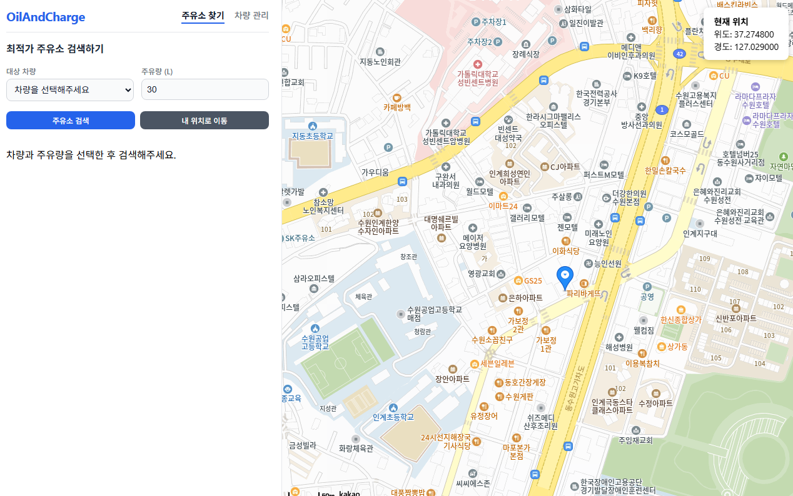
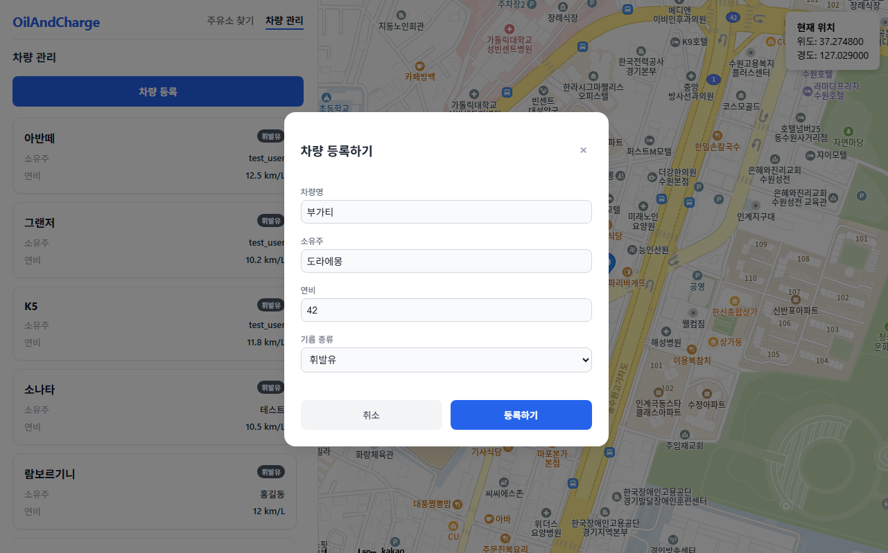
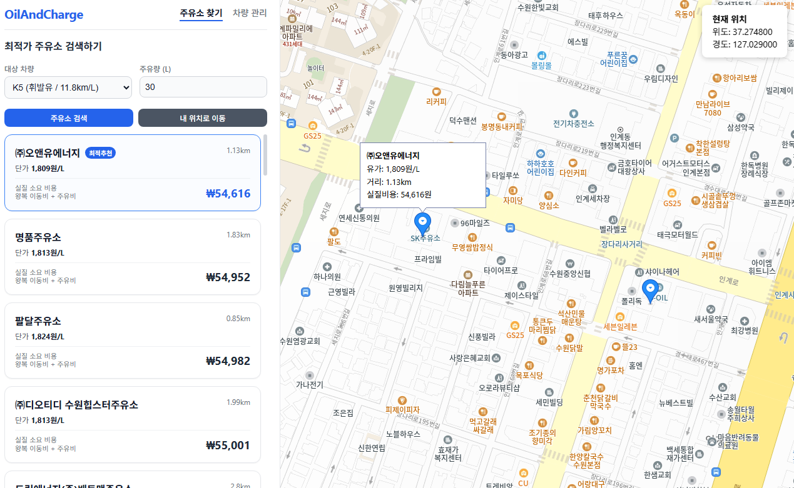
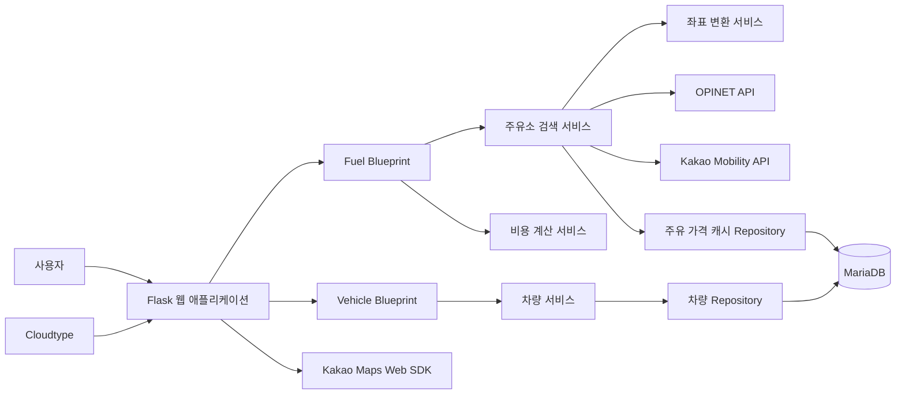

# OilAndCharge

사용자 위치와 등록 차량의 연비를 바탕으로 주변 주유소를 찾고, 주유 가격과 왕복 이동비를 함께 계산하는 웹 서비스입니다.

현재 MVP는 휘발유 차량과 휘발유(B027) 조회를 대상으로 합니다.


## 프로젝트 소개 및 접속 링크

[서비스 접속하기](https://port-0-oilandcharge-mstwa15r85de9006.sel3.cloudtype.app/)

Cloudtype 배포 정책상 매일 자정에 서버가 휴면 상태에 돌입할 수 있습니다. 접속이 되지 않는 경우 배포 관리자의 서버 활성화가 필요합니다.

## 팀 구성 및 역할 분담

| 구분 | 담당자 | 역할 |
| --- | --- | --- |
| 기획 및 문서화 | 박성진 | 서비스 요구사항 정리, README 및 문서 관리 |
| 백엔드 | 이규원, 홍은지 | Flask API, 주유소 검색, 비용 계산, 차량 관리 |
| 프론트엔드 | 홍동연, 권순현 | 화면 구성, 사용자 입력, 결과 표시, Kakao Maps 연동 |
| 인프라 및 배포 | 박성진 | MariaDB 및 Cloudtype 배포 환경 관리 |

## 시연 영상 및 서비스 화면

[](https://youtu.be/MbcDpnc_Ljg)

| 메인 화면 | 차량 등록 화면 | 조회 결과 화면 |
| --- | --- | --- |
|  |  |  |

## 주요 기능

- 주변 주유소 조회 및 카카오맵 마커 표시
- 등록 차량의 연비를 반영한 왕복 이동비 계산
- 주유량, 리터당 가격, 이동비를 합산한 예상 소요 비용 계산
- 차량 등록 및 등록 차량 목록 조회
- OPINET 조회 결과의 데이터베이스 캐싱
- 서버 상태 확인을 위한 헬스 체크

## 기술 스택

| 구분 | 기술 |
| --- | --- |
| Backend | Python 3.10+, Flask, Gunicorn |
| Frontend | HTML5, CSS3, JavaScript |
| Database | MariaDB, PyMySQL |
| 지도 | Kakao Maps |
| 좌표 변환 | pyproj |
| HTTP / 환경 설정 | requests, python-dotenv |
| Deployment | Cloudtype |

## 사용 외부 API

| API | 용도 | 인증 환경 변수 |
| --- | --- | --- |
| [OPINET](https://www.opinet.co.kr/) `aroundAll.do` | 반경 내 휘발유 주유소 및 가격 조회 | `OPINET_API_KEY` |
| [Kakao Mobility](https://developers.kakaomobility.com/) | 경로 탐색 및 이동 거리 계산 | `KAKAO_REST_API_KEY` |
| [Kakao Maps Web SDK](https://apis.map.kakao.com/) | 지도 렌더링 및 주유소 마커 표시 | `KAKAO_JAVASCRIPT_KEY` |

> 유가정보 데이터는 한국석유공사 오피넷에서 제공하는 API를 활용해서 제작되었습니다.

## 서비스 아키텍처



- `app/fuel/`: 주유소 검색, 좌표 변환, 경로 거리와 비용 계산을 담당합니다.
- `app/vehicle/`: 차량 등록과 조회를 담당합니다.
- `app/models/database.py`: MariaDB 연결과 요청 종료 시 연결 해제를 담당합니다.
- WGS84 위치 좌표를 OPINET 요청용 KATEC/TM128 좌표로 변환하고, 응답 좌표는 다시 WGS84로 변환해 지도에 표시합니다.
- 애플리케이션은 Cloudtype을 통해 배포합니다.

## API 명세 (Swagger UI)

| Method | Endpoint | 설명 |
| --- | --- | --- |
| `GET` | `/` | 메인 화면 |
| `GET` | `/history` | 계산 이력 화면. 현재는 빈 목록을 표시합니다. |
| `GET` | `/car` | 차량 목록 및 차량 등록 화면 |
| `GET` | `/health` | 서버 상태 확인. 정상 응답 시 `status: ok`를 반환합니다. |
| `GET` | `/api/stations` | 주변 주유소 검색 및 차량 연비 기반 비용 계산 |
| `GET` | `/api/vehicles` | 등록 차량 목록 조회. 선택적으로 `owner` 쿼리 파라미터를 사용할 수 있습니다. |
| `POST` | `/api/vehicles` | 차량 등록. JSON 본문에 `owner`, `vehicle_name`, `fuel_efficiency`, `fuel_type`을 사용합니다. |
| `POST` | `/calculate` | 입력한 연비, 주유량, 거리, 가격을 기준으로 이동비와 총비용 계산 |

API 엔드포인트의 상세 명세는 Swagger UI에서도 확인 가능합니다.

- 로컬 실행: `http://localhost:5000/apidocs`
- 배포 환경: `https://port-0-oilandcharge-mstwa15r85de9006.sel3.cloudtype.app/apidocs`
- OpenAPI 원본 파일: [app/static/swagger.yaml](app/static/swagger.yaml)

Swagger UI에서 각 API의 요청 파라미터, 요청 본문, 응답 코드와 예시를 확인하고 `Try it out`으로 직접 호출해 볼 수 있습니다. 서버가 실행 중이 아니면 Swagger UI에 접속할 수 없으므로 먼저 애플리케이션을 실행해 주세요.

## 프로젝트 디렉토리 구조

```text
app/
        __init__.py              # Flask 애플리케이션 및 Blueprint 초기화
        config.py                # 환경 변수 기반 설정
        fuel/                    # 주유소 검색, 좌표 변환, 비용 계산
        models/                  # 데이터베이스 연결
        static/                  # CSS 및 JavaScript
        templates/               # Jinja2 HTML 템플릿
        vehicle/                 # 차량 등록 및 조회
docs/images/                 # README 서비스 화면 이미지
requirements.txt             # Python 의존성
run.py                       # 애플리케이션 실행 진입점
```

## 시작하기 / 실행 방법

### 사전 요구사항

- Python 3.10 이상
- MariaDB 접근 정보 및 실행 가능한 데이터베이스
- OPINET API 키
- Kakao REST API 키 및 JavaScript 키
- Windows PowerShell 또는 가상 환경을 활성화할 수 있는 터미널

### 설치 및 실행

```bash
python -m venv venv
.\venv\Scripts\activate
pip install -r requirements.txt
```

### 환경 변수 설정 (`.env` Configuration)

프로젝트 루트에 `.env` 파일을 만들고 다음 값을 설정합니다. API 키와 데이터베이스 비밀번호는 저장소에 커밋하지 않아야 합니다.

```env
SECRET_KEY=change-me
OPINET_API_KEY=your-opinet-api-key
KAKAO_REST_API_KEY=your-kakao-rest-api-key
KAKAO_JAVASCRIPT_KEY=your-kakao-javascript-api-key
DB_HOST=your-db-host
DB_PORT=3306
DB_USER=your-db-user
DB_PASSWORD=your-db-password
DB_NAME=your-db-name
```

`DB_PORT`를 생략하면 기본값 `3306`이 사용됩니다.

### 애플리케이션 실행

```bash
python run.py
```

브라우저에서 `http://localhost:5000`에 접속합니다.

> **배포 환경 안내:** Cloudtype 무료 플랜을 사용하므로 서버는 매일 자정에 자동으로 중지됩니다.

## 향후 개선 계획

- 전기차 충전소와 경유, LPG 등 유종 확대
- 사용자 위치 직접 지정
- 차량 수정 및 삭제
- 정렬, 즐겨찾기, 지도 마커와 목록의 상호작용 개선
- 계산 이력의 데이터베이스 저장 및 조회
- 사용자 인증과 사용자별 차량·계산 이력 관리
